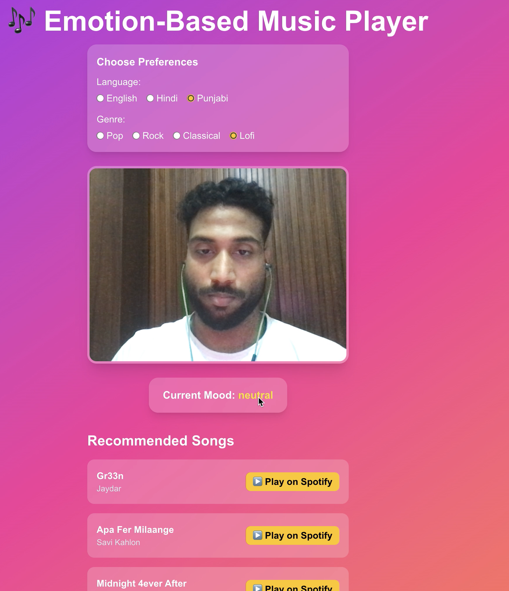

<p align="center">
  
</p>

# 🎶 Emotion-Based Music Player

An **AI-powered music recommendation app** that detects your real-time **facial emotions** 🎥 and suggests personalized **Spotify tracks** 🎵 based on your **mood, language, and genre preferences**.

Built with **FastAPI + Deep Learning (FER/DeepFace) + Next.js + Tailwind + Spotify API + Docker** 🚀

---

## ✨ Features

- ✅ Real-time **emotion detection** from webcam (happy, sad, angry, surprise, neutral, etc.)
- ✅ **Spotify integration** to fetch recommended tracks 🎧
- ✅ User can choose **preferred language** (English, Hindi, Punjabi, etc.)
- ✅ User can choose **preferred genre** (Pop, Rock, Classical, Lofi, etc.)
- ✅ Built-in **music player** (Play, Pause, Seek) using Spotify `preview_url`
- ✅ **Fallback to Spotify app** if no preview available
- ✅ Beautiful **UI with Tailwind + Framer Motion animations**
- ✅ **Dockerized backend** for smooth deployment

---

## 🖼️ Demo




---

## 🏗️ Tech Stack

### 🎯 Frontend
- [Next.js 14](https://nextjs.org/) + [React](https://react.dev/)
- [Tailwind CSS](https://tailwindcss.com/) for styling
- [Framer Motion](https://www.framer.com/motion/) for animations

### ⚡ Backend
- [FastAPI](https://fastapi.tiangolo.com/)
- [FER](https://github.com/justinshenk/fer) / [DeepFace](https://github.com/serengil/deepface) for emotion recognition
- [TensorFlow](https://www.tensorflow.org/) & [PyTorch](https://pytorch.org/)
- [Spotify Web API](https://developer.spotify.com/documentation/web-api/)

### 🐳 Deployment
- Docker + Docker Compose

---

## 🚀 Getting Started

### 1️⃣ Clone the Repo
```bash
git clone https://github.com/your-username/emotion-music-player.git
cd emotion-music-player
```

---

### 2️⃣ Backend Setup (FastAPI + Docker)
```bash
cd backend
cp .env.example .env  # add your SPOTIFY_CLIENT_ID and SPOTIFY_CLIENT_SECRET
docker compose up --build
```

Backend will start on:  
👉 [http://localhost:8000/docs](http://localhost:8000/docs)

---

### 3️⃣ Frontend Setup (Next.js)
```bash
cd frontend
npm install
npm run dev
```

Frontend will run on:  
👉 [http://localhost:3000](http://localhost:3000)

---

### 4️⃣ Spotify API Setup
1. Go to [Spotify Developer Dashboard](https://developer.spotify.com/dashboard/)  
2. Create a new app → get `CLIENT_ID` and `CLIENT_SECRET`  
3. Add them in `backend/.env`:  

```env
SPOTIFY_CLIENT_ID=your_id_here
SPOTIFY_CLIENT_SECRET=your_secret_here
```

---

## 🎥 How It Works

1. User opens the app → grants camera permission  
2. Camera captures frames every few seconds  
3. Backend analyzes face → detects emotion  
4. Based on emotion + selected **language/genre**, Spotify API is queried  
5. App displays recommended songs with a built-in music player  

---

## 📂 Project Structure

```
emotion-music-player/
├── backend/                # FastAPI + Emotion Detection
│   ├── app/
│   │   ├── main.py         # FastAPI routes
│   │   ├── emotion.py      # Emotion detection logic
│   ├── Dockerfile
│   ├── requirements.txt
│
├── frontend/               # Next.js + Tailwind
│   ├── src/app/
│   │   ├── player/page.tsx # Main player UI
│   │   ├── components/     # AudioPlayer, CameraCapture etc.
│   ├── package.json
│   └── tailwind.config.js
│
|── docker-compose.yml
├── assets/                 # Screenshots, banner, GIFs
│   └── banner.png
│
└── README.md
```

---

## 🛠️ Future Improvements

- 🎤 Voice commands (e.g., “play happy songs”)
- 📱 Mobile app version with React Native / Flutter
- 🤝 Multi-user support with accounts
- 🎨 More advanced UI like Spotify clone

---

## 👨‍💻 Contributors

- **Your Name** – [@karansingla007](https://github.com/karansingla007)

---

## ⭐ Support

If you like this project, don’t forget to **star ⭐ the repo**.  
Pull requests are welcome 🚀

---
